# Add Cloudflare Deployment Support to cloakmail

## Context

cloakmail currently only supports Docker/VPS deployment via `packages/server` (Bun + Elysia + smtp-server + Redis) and `packages/web` (SvelteKit + adapter-node). The user wants a **second** deployment path that runs entirely on Cloudflare's free tier (Workers + D1 + R2 + Email Routing) so that anyone can launch their own instance without provisioning servers.

This work spans **two repos**:
1. **`cloakmail`** (this repo) — gains a new `packages/cloudflare` workspace (Worker source code + D1 schema + wrangler.toml templates) and one small additive change in `packages/web` (conditional adapter selection). The Docker path stays exactly as-is — `packages/server`, `docker-compose*.yml`, GHCR images, and the existing CI workflows are untouched.
2. **`cloakmail-cli`** (sibling repo at `/Users/devoresyah/Documents/cloakmail/cloakmail-cli/`) — a brand-new standalone CLI built with [seedcli](https://seedcli.dev) that owns the entire installation experience. Replaces what was originally planned as `bun run cloudflare:setup` inside the cloakmail repo. Distributed independently (npm/bunx), so users never have to clone the cloakmail repo themselves.

**Intended outcome**: A user runs ONE command — `bunx cloakmail-cli setup` (or `cloakmail-cli setup` if installed globally) — from any directory on their machine, and ends up with a fully working temp email service at **whatever single hostname they choose**. The CLI owns the entire deployment lifecycle from a clean state: it acquires the cloakmail source, prompts for Cloudflare credentials and config, creates D1 + R2, renders wrangler.toml from templates, deploys both Workers, runs migrations, configures Email Routing, binds the custom domain, and verifies the whole thing works. No dashboard clicks, no manual config files, no forced naming. Free tier, up to ~30k–100k emails/day.

The CLI is **idempotent**: safe to re-run, detects existing resources via Cloudflare API GETs, updates in place. State is cached in `~/.cloakmail-cli/state.json` so re-runs skip prompts and resume from the last incomplete step.

---

## Architecture

**Single user-facing hostname.** The user picks ONE hostname. The web Worker serves the SvelteKit app at that hostname AND proxies `/api/*` requests through the service binding to the API Worker. The API Worker has no public hostname — it's only reachable internally via the binding (more secure, no CORS, fewer DNS records, no `mail.`/`api.` naming convention forced on the user).

**Two Workers + Service Binding** (chosen because `@sveltejs/adapter-cloudflare` generates its own entrypoint and refuses to coexist with custom `email`/`scheduled` exports):

```
                          Cloudflare Edge
  ┌──────────────────────────────────────────────────────────┐
  │  Email Routing  ──email()──▶  cloakmail-api Worker       │
  │  (zone catch-all)             - Hono /api/*              │
  │                               - email() handler          │
  │                               - scheduled() (cron)       │
  │                               - bindings: DB, R2         │
  │                               - NO public hostname       │
  │                                    │      │              │
  │                                    ▼      ▼              │
  │                                  D1     R2 bucket        │
  │                                                          │
  │                       ┌── env.API.fetch() ──┐            │
  │                       │  (service binding)  │            │
  │                       ▼                     │            │
  │  HTTPS ──▶  cloakmail-web Worker            │            │
  │   (user's chosen     - SvelteKit (adapter-cloudflare)    │
  │    hostname)         - hooks.server.ts proxies /api/*    │
  │                      - service binding: API              │
  └──────────────────────────────────────────────────────────┘

  Inbound MIME mail   ─────▶ cloakmail-api email() handler
  Browser /api/*      ─────▶ cloakmail-web /api/* hook ─▶ env.API.fetch
  Browser SSR pages   ─────▶ cloakmail-web SvelteKit ────▶ env.API.fetch
```

Browsers and external API consumers all hit the **same single hostname**. The web Worker is the only edge entry point.

**Storage strategy — D1 + R2 smart split**:
- 95% of temp emails are <100KB (verification codes, magic links) → store fully inline in D1 = **1 write per email**
- 5% are larger → metadata + previews in D1, full body as JSON blob in R2 = 1 D1 + 1 R2 write
- **Free tier ceiling: ~100k emails/day** (D1 write limit). Without smart split it would cap at 33k/day (R2 write limit).

**TTL handling**:
- D1 column `expires_at_ms`. Reads filter `WHERE expires_at_ms > now()` so users never see expired rows.
- Cron Trigger Worker runs daily (`0 3 * * *`), `DELETE WHERE expires_at_ms <= now()` plus R2 object cleanup for spilled rows.

---

## Configuration authority — single source of truth

The wizard collects user input once. Every downstream config field derives from it. There's no place where the user has to type the same value twice, and no risk of drift between `wrangler.toml` and the running Worker's environment.

| User input (collected by wizard) | Required? | Default | Used to populate |
|---|---|---|---|
| `email_zone` | **yes** | none | `DOMAIN` (API Worker var) · `PUBLIC_EMAIL_DOMAIN` (web Worker var) · the zone enabled for Email Routing · the zone the catch-all rule is created on |
| `web_hostname` | **yes** | suggests `email_zone` (apex) and a few subdomain options; user types or accepts | The Workers Custom Domain hostname bound to the web Worker. Independent of `email_zone` — can be the same domain (apex), a subdomain on the same zone, or a hostname on a different zone in the same account. |
| `cf_api_token` | **yes** | none | All CF REST API calls + `CLOUDFLARE_API_TOKEN` env for spawned `wrangler` commands |
| `api_worker_name` | optional | `cloakmail-api-{adjective}-{noun}` (e.g. `cloakmail-api-shadow-falcon`) using the same wordlist as `packages/web/src/lib/utils/generateAddress.ts` | `name` field of API worker's `wrangler.toml` · service binding target in web's `wrangler.toml` · catch-all routing rule's `actions[0].value` |
| `web_worker_name` | optional | `cloakmail-web-{adjective}-{noun}` | `name` field of web worker's `wrangler.toml` · custom-domain `service` field |
| `d1_database_name` | optional | `cloakmail-{adjective}-{noun}` | `database_name` in API wrangler.toml · D1 created via `wrangler d1 create` · migrations target |
| `r2_bucket_name` | optional | `cloakmail-bodies-{adjective}-{noun}` | `bucket_name` in API wrangler.toml · R2 bucket created via `wrangler r2 bucket create` |
| `email_ttl_seconds` | optional | `86400` (24h) | `EMAIL_TTL_SECONDS` API Worker var |
| `max_email_size_mb` | optional | `10` | `MAX_EMAIL_SIZE_MB` API Worker var |
| `app_name` | optional | `CloakMail` | `PUBLIC_APP_NAME` web Worker var |

**Random-suffix defaults** prevent collisions when multiple cloakmail instances are deployed to the same Cloudflare account. The wordlist is reused from `packages/web/src/lib/utils/generateAddress.ts:1-11` (already shipped, ~36 words) so we don't introduce a new dictionary.

**The wizard never asks the user the same value twice.** For example: `DOMAIN` and `PUBLIC_EMAIL_DOMAIN` both come from `email_zone` — the user only types `example.com` once. Similarly the catch-all rule's worker target is derived from `api_worker_name`, not asked separately.

---

## CLI distribution model — `cloakmail-cli`

The installation experience is owned by a **standalone CLI** at `/Users/devoresyah/Documents/cloakmail/cloakmail-cli/`, built with [seedcli](https://seedcli.dev) (a TypeScript-first, Bun-powered CLI framework). This is a separate repo and a separate npm package from the main cloakmail repo. Users never have to clone cloakmail manually — the CLI handles everything.

### How users invoke it

```bash
# Zero-install (recommended for first-time users)
bunx cloakmail-cli setup

# Or install once, run many times
bun install -g cloakmail-cli
cloakmail-cli setup

# Local dev / forks (uses a local cloakmail checkout instead of cloning)
cloakmail-cli setup --from /path/to/cloakmail

# Pin to a specific cloakmail release
cloakmail-cli setup --version v1.2.0
```

### How the CLI gets the cloakmail source code

The cloakmail repo contains all the worker source files (`packages/cloudflare/src/`), the D1 migration, and the wrangler.toml templates. The CLI doesn't bundle any of that — it acquires it on demand:

| Mode | Trigger | What happens |
|---|---|---|
| **Default (clone latest tag)** | `cloakmail-cli setup` with no flags | CLI fetches the latest release tarball from `https://github.com/DreamsHive/cloakmail/archive/refs/tags/{latest}.tar.gz` into `~/.cloakmail-cli/cache/{version}/` and runs the wizard against that directory |
| **Pin a version** | `--version v1.2.0` | Same, but fetches the requested tag |
| **Local checkout** | `--from /path/to/cloakmail` | Skips the fetch, points the wizard at the user's local clone. Used for cloakmail development or running a fork |

The cache is keyed by version so re-runs of the same version skip the fetch. `cloakmail-cli cache clear` (v2 command) wipes it.

**Why fetch instead of bundle**: keeps the CLI binary small (the worker source code can grow); decouples CLI version from cloakmail version (CLI v1.0 can deploy cloakmail v1.0, v1.1, v1.2 without a CLI release); makes "pin to version" a first-class feature; lets users hack on a fork via `--from` without rebuilding the CLI.

**Why GitHub release tarball, not git clone**: no `git` dependency on the user's machine; smaller download (no `.git` history); deterministic (a tag is immutable); works in air-gapped or git-restricted environments via a `--tarball <url>` escape hatch.

### Why a separate CLI instead of `bun run cloudflare:setup` inside the repo

| Concern | Old plan (`bun run cloudflare:setup`) | New plan (`cloakmail-cli`) |
|---|---|---|
| Discoverability | User has to clone cloakmail first, then know to run a script inside it | Single command anywhere, no clone required |
| Install friction | Clone + `bun install` (300+ MB of node_modules) before the wizard even prints | `bunx cloakmail-cli setup` — pulls only the CLI's tiny dep tree |
| Distribution | Tied to cloakmail repo releases | Independently versioned, can be `bun install -g`'d |
| Updates | Re-clone + re-install on every cloakmail change | `bun update -g cloakmail-cli` for CLI, `--version` flag for the deployed cloakmail |
| Multiple instances | Awkward (clone twice, isolated `node_modules`) | `cloakmail-cli setup` twice with different worker name overrides |
| Code reuse from seedcli | Would have to hand-roll prompt UX, exec wrappers, HTTP client, etc. | Inherits seedcli's batteries (`prompt`, `system`, `http`, `template`, `print`, `config`) |
| Testability | Custom harness | `@seedcli/testing` ships `createTestCli` with mockable prompts and HTTP |

### CLI ↔ cloakmail repo coupling

The CLI knows about cloakmail's structure in exactly two places:
1. **Template paths it expects to find** in the acquired source: `packages/cloudflare/wrangler.toml.template`, `packages/web/wrangler.toml.template`, `packages/cloudflare/migrations/0001_init.sql`, `packages/web/svelte.config.js`
2. **Wrangler invocations** it issues: `wrangler d1 create`, `wrangler r2 bucket create`, `wrangler deploy` (run from `packages/cloudflare/` and `packages/web/` subdirectories), `wrangler d1 migrations apply`

If the cloakmail repo changes one of those paths, the CLI's source-acquisition step does a manifest-version check (reads `packages/cloudflare/.cli-manifest.json` from the acquired source — a tiny file declaring which file paths the CLI should expect for that cloakmail version). Mismatched manifests trigger a "please upgrade cloakmail-cli" warning with the minimum required CLI version.

This is the only piece of explicit version coupling. Everything else is dynamic.

---

## Authentication model

The user authenticates **once**, inside the CLI, by pasting a Cloudflare **API token** when prompted. There is no separate "log in to Cloudflare" step before running the CLI. Specifically:

- **No `wrangler login` browser OAuth flow.** Browser OAuth requires a TTY popup, doesn't work over SSH, and pollutes a global wrangler config that can interfere with other Cloudflare projects on the same machine. We avoid it.
- **No environment variable required upfront.** The user does not have to `export CLOUDFLARE_API_TOKEN=...` before running the CLI. The CLI prompts for it and holds it in memory.
- **No `~/.wrangler/config.toml` writes.** `wrangler` ships as a regular dependency of `cloakmail-cli` and is invoked via `seed.system.exec("wrangler", [...])` from the cloned cloakmail directory. Auth is passed per-invocation via the `CLOUDFLARE_API_TOKEN` env var on the spawned process — never written to disk.
- **The token may optionally be cached.** By default the token is held only in memory and forgotten when the CLI exits. The user can opt in to caching it (encrypted with the OS keychain via the `keytar`-equivalent library or simply `0600`-permissioned in `~/.cloakmail-cli/state.json`) by passing `--save-token` once. Re-runs without `--save-token` always prompt fresh.

**One-screen onboarding** before the token prompt: the CLI prints a clickable URL to the Cloudflare API token creation page (`https://dash.cloudflare.com/profile/api-tokens`) along with the exact list of required scopes. The user creates a token with those scopes, pastes it back into the CLI prompt, and never has to leave the terminal again.

The token is used for:
1. Direct calls to `api.cloudflare.com/client/v4/...` via `seed.http` (Email Routing, Workers Custom Domains, zone lookups, account verification)
2. Spawned `wrangler ...` commands via `seed.system.exec` (D1 create, R2 create, deploy, migrations) — passed via the `CLOUDFLARE_API_TOKEN` env var so wrangler picks it up automatically without writing any config

The Worker itself does **not** need the token at runtime. It only needs the D1 and R2 bindings, which are configured at deploy time and don't require any credentials at request time.

---

## `cloakmail-cli` project structure

Already scaffolded at `/Users/devoresyah/Documents/cloakmail/cloakmail-cli/` via `bun create seedcli`. Current state has the seedcli template hello command and timer extension — these will be removed. The final structure:

```
cloakmail-cli/
├── package.json                       # bin: cloakmail-cli; deps: @seedcli/core, wrangler
├── seed.config.ts                     # build entry config (already exists)
├── tsconfig.json                      # already exists
├── biome.json                         # already exists
├── src/
│   ├── index.ts                       # build("cloakmail-cli").src().version().help().debug().create()
│   ├── commands/                      # auto-discovered by .src()
│   │   ├── setup.ts                   # MAIN COMMAND — the wizard
│   │   ├── status.ts                  # (v2) show current deployment health, MX, custom domain, worker URLs
│   │   ├── destroy.ts                 # (v2) tear down workers, D1, R2, custom domain — with confirmation
│   │   └── upgrade.ts                 # (v2) re-acquire latest cloakmail source, redeploy without re-prompting
│   ├── extensions/                    # auto-discovered by .src()
│   │   ├── cloudflare.ts              # attaches seed.cloudflare = { api: typed REST wrapper, listZones, getAccountId, ... }
│   │   ├── wrangler.ts                # attaches seed.wrangler = { d1Create, d1List, r2Create, deploy, migrate, ... } via seed.system.exec
│   │   ├── source.ts                  # attaches seed.source = { acquire(version|fromPath), root: string, manifest: ... }
│   │   └── state.ts                   # attaches seed.state = { load(), save(), clear() } reading ~/.cloakmail-cli/state.json
│   └── lib/                           # plain helpers (not commands or extensions)
│       ├── steps/                     # the wizard pipeline split into composable functions
│       │   ├── 01-validate.ts         # Phase 1: prereqs + token auth
│       │   ├── 02-prompts.ts          # Phase 2: collect inputs
│       │   ├── 03-acquire.ts          # Phase 3: fetch cloakmail source
│       │   ├── 04-provision.ts        # Phase 4: D1, R2 via wrangler
│       │   ├── 05-render.ts           # Phase 5: render wrangler.toml templates
│       │   ├── 06-deploy.ts           # Phase 6: build + deploy both workers
│       │   ├── 07-routing.ts          # Phase 7: Email Routing config
│       │   ├── 08-domain.ts           # Phase 8: bind custom domain
│       │   └── 09-verify.ts           # Phase 9: health probe + site probe
│       ├── names.ts                   # randomWorkerSuffix() — adj+noun from a small wordlist (~36 words)
│       ├── render.ts                  # renderTemplate(content, vars) — `{{KEY}}` substitution via seed.template
│       └── errors.ts                  # CfError, WranglerError, AcquireError classes
└── tests/
    ├── setup.test.ts                  # createTestCli(runtime).mockPrompt(...).mockHttp(...).run("setup")
    ├── steps/                         # unit tests for each step in isolation
    │   ├── prompts.test.ts
    │   ├── render.test.ts
    │   └── routing.test.ts
    └── fixtures/
        └── cloakmail-mock/             # a stub directory mimicking packages/cloudflare/ + packages/web/ for tests
```

### Mapping seedcli concepts to cloakmail-cli responsibilities

| seedcli module | Used for |
|---|---|
| `@seedcli/core` `build`, `command`, `arg`, `flag` | Defining the `setup` command with `--from`, `--version`, `--save-token`, `--reset` flags |
| `@seedcli/print` (`seed.print`) | All terminal output: `print.info`, `print.success`, `print.warning`, `print.error`, `print.spin` (the spinner during long ops), `print.box` (the success summary card), `print.table` (the config preview), `print.tree` (showing what will be deployed) |
| `@seedcli/prompt` (`seed.prompt`) | Replaces `@clack/prompts`. `prompt.input` (email zone, web hostname, names), `prompt.password` (CF API token), `prompt.confirm` (overwrite warnings), `prompt.select` (choosing among hostname suggestions), `prompt.form` (the advanced settings batch) |
| `@seedcli/system` (`seed.system`) | Replaces `child_process.spawn`. `system.exec("wrangler", ["d1", "create", name], { env: { CLOUDFLARE_API_TOKEN: token } })`. Also `system.which("wrangler")` for prereq check, `system.isInteractive()` to gate spinners |
| `@seedcli/http` (`seed.http`) | Replaces hand-rolled `cfFetch`. `http.create({ baseURL: "https://api.cloudflare.com/client/v4", headers: { Authorization: \`Bearer ${token}\` } })` returns a typed client we use for every CF REST call. Built-in retry, error handling, JSON serialization |
| `@seedcli/filesystem` (`seed.filesystem`) | Replaces `fs.readFile`/`writeFile`. Reading templates from the acquired cloakmail dir, writing rendered wrangler.toml, creating `~/.cloakmail-cli/cache/` and `~/.cloakmail-cli/state.json` |
| `@seedcli/template` (`seed.template`) | Replaces our custom `renderTemplate`. Renders `wrangler.toml.template` with `{{API_WORKER_NAME}}` etc. via `template.renderString(content, vars)` |
| `@seedcli/config` (`seed.config`) | Loads `~/.cloakmail-cli/state.json` so re-runs of `setup` skip prompts and resume |
| `@seedcli/strings` (`seed.strings`) | Worker name validation (`kebabCase`), random suffix generation, hostname normalization |
| `@seedcli/ui` (`seed.ui`) | The big success card via `ui.box(...)`, the config summary via `ui.list(...)`, the deploy progress via `ui.status(...)` |
| `@seedcli/testing` | `createTestCli(runtime).mockPrompt(...).mockHttp(...).run("setup")` for unit-testing the wizard end-to-end without hitting Cloudflare |

### Why extensions, not loose helpers

seedcli extensions run before any command and attach typed state to the `seed` context. We use four:

- **`cloudflare` extension** — initializes a typed `seed.http` client pointed at `api.cloudflare.com/client/v4` once the token is known. Subsequent steps just call `seed.cloudflare.api.get('/zones', { params: { name: domain } })`.
- **`wrangler` extension** — wraps `seed.system.exec` with the project's standard env (`CLOUDFLARE_API_TOKEN`, working directory for the relevant cloakmail subdirectory). Steps call `await seed.wrangler.deploy("packages/cloudflare")` instead of building the spawn args by hand.
- **`source` extension** — owns the cloakmail source acquisition. Reads `--from` and `--version` flags, fetches/copies, validates the manifest, attaches `seed.source.root` (the absolute path to the acquired cloakmail dir) for downstream steps.
- **`state` extension** — loads `~/.cloakmail-cli/state.json` at startup, exposes `seed.state.get(key)` / `seed.state.set(key, value)`, persists on graceful shutdown via `teardown`.

Each extension is its own file in `src/extensions/`, auto-discovered by `build("cloakmail-cli").src(import.meta.dirname)`.

### What's NOT in the CLI

- **No worker source code.** All `.ts` files in `packages/cloudflare/src/` (`worker.ts`, `api.ts`, `store.ts`, `email.ts`, `spam.ts`) live in the cloakmail repo. The CLI never reads or modifies them — it just runs `wrangler deploy` from inside that directory.
- **No D1 schema.** `migrations/0001_init.sql` is in the cloakmail repo, applied via `wrangler d1 migrations apply --remote`.
- **No SvelteKit code.** The web worker source stays in `packages/web/`.
- **No business logic.** The CLI is purely an installer/orchestrator. All cloakmail behavior is in the cloakmail repo.

This separation means a cloakmail bug fix doesn't require a CLI release, and vice versa.

---

## Deployment flow diagram

The full path from "user has a Cloudflare account and wants cloakmail" to "live temp email service":

```mermaid
flowchart TD
    Start([User wants cloakmail on Cloudflare]) --> CFAccount{Has CF account<br/>+ a domain in CF DNS?}
    CFAccount -->|No| AddCF[Sign up for Cloudflare<br/>+ add domain to CF DNS]
    AddCF --> RunCmd
    CFAccount -->|Yes| RunCmd[Run: bunx cloakmail-cli setup<br/>NO repo clone needed]

    subgraph Phase1[Phase 1 — Validate & Authenticate]
        RunCmd --> CheckPrereqs[Validate prereqs:<br/>wrangler callable, network reachable,<br/>state file readable]
        CheckPrereqs --> LoadState[Load ~/.cloakmail-cli/state.json<br/>if exists and not --reset]
        LoadState --> ShowScopes[Show required CF API token scopes<br/>+ clickable link to dashboard token page]
        ShowScopes --> CreateToken[User opens dashboard,<br/>creates token with required scopes,<br/>copies it]
        CreateToken --> PasteToken[seed.prompt.password<br/>paste API token]
        PasteToken --> Verify[seed.cloudflare.api.get<br/>/user/tokens/verify]
        Verify --> TokenOk{Token valid<br/>+ has required scopes?}
        TokenOk -->|No| PasteToken
        TokenOk -->|Yes| CaptureAcct[Capture account_id<br/>from response]
    end

    subgraph Phase2[Phase 2 — Collect inputs]
        CaptureAcct --> AskZone[seed.prompt.input<br/>email zone e.g. example.com]
        AskZone --> ValidateZone[seed.cloudflare.api.get /zones]
        ValidateZone --> ZoneIn{Zone in this<br/>CF account?}
        ZoneIn -->|No| ShowAddZone[Print add-zone link,<br/>re-prompt]
        ShowAddZone --> AskZone
        ZoneIn -->|Yes| AskHost[seed.prompt.select with custom branch<br/>web hostname - any name user wants]
        AskHost --> ResolveWeb[Resolve hostname to a<br/>zone in same account]
        ResolveWeb --> WebOk{Web zone<br/>resolvable?}
        WebOk -->|No| AskHost
        WebOk -->|Yes| Adv{Advanced<br/>settings?}
        Adv -->|Skip| UseRandom[Generate random adj-noun<br/>suffixes via src/lib/names.ts]
        Adv -->|Open| AskAdv[seed.prompt.input for worker names,<br/>D1, R2, TTL, max size, app name]
        UseRandom --> Summary[seed.print.box summary card<br/>with every value]
        AskAdv --> Summary
        Summary --> Confirm{seed.prompt.confirm?<br/>--yes to skip}
        Confirm -->|n - edit| AskZone
    end

    Confirm -->|y| SaveState[seed.state.save<br/>~/.cloakmail-cli/state.json<br/>so re-runs resume]

    subgraph Phase3[Phase 3 — Acquire cloakmail source]
        SaveState --> FromFlag{--from path<br/>given?}
        FromFlag -->|Yes| UseLocal[Use local checkout<br/>seed.source.root = path]
        FromFlag -->|No| CheckCache[Check ~/.cloakmail-cli/cache/<br/>for requested version]
        CheckCache --> Cached{Cached?}
        Cached -->|Yes| UseCached[seed.source.root = cached path]
        Cached -->|No| FetchTar[seed.http.download<br/>github.com/.../tags/version.tar.gz]
        FetchTar --> Extract[seed.system.exec tar -xzf<br/>into ~/.cloakmail-cli/cache/]
        Extract --> ManifestCheck[Read .cli-manifest.json<br/>verify CLI version compat]
        UseLocal --> ManifestCheck
        UseCached --> ManifestCheck
        ManifestCheck --> CompatOk{CLI version<br/>compatible?}
        CompatOk -->|No| UpgradeHint[Print upgrade hint, exit]
    end

    subgraph Phase4[Phase 4 — Provision Cloudflare resources]
        CompatOk -->|Yes| ListD1[seed.wrangler.d1List]
        ListD1 --> D1Exists{DB with<br/>this name?}
        D1Exists -->|Yes| ReuseD1[Reuse its uuid]
        D1Exists -->|No| CreateD1[seed.wrangler.d1Create<br/>parse stdout for database_id]
        ReuseD1 --> ListR2
        CreateD1 --> ListR2[seed.wrangler.r2List]
        ListR2 --> R2Exists{Bucket<br/>exists?}
        R2Exists -->|Yes| SkipR2[Skip]
        R2Exists -->|No| CreateR2[seed.wrangler.r2Create]
        SkipR2 --> RenderApi
        CreateR2 --> RenderApi[seed.template.renderString<br/>packages/cloudflare/wrangler.toml.template]
        RenderApi --> RenderWeb[seed.template.renderString<br/>packages/web/wrangler.toml.template]
    end

    subgraph Phase5[Phase 5 — Build & deploy Workers]
        RenderWeb --> DeployApi[seed.wrangler.deploy<br/>packages/cloudflare<br/>API worker live on workers.dev]
        DeployApi --> Migrate[seed.wrangler.migrate<br/>creates emails table + indexes]
        Migrate --> BuildWeb[seed.system.exec ADAPTER=cloudflare<br/>bun run build in packages/web]
        BuildWeb --> DeployWeb[seed.wrangler.deploy<br/>packages/web<br/>service binding to API resolves]
    end

    subgraph Phase6[Phase 6 — Wire up Email Routing]
        DeployWeb --> CheckRouting[seed.cloudflare.api.get<br/>/zones/.../email/routing]
        CheckRouting --> RoutingOn{Already<br/>enabled?}
        RoutingOn -->|No| EnableRouting[POST .../email/routing/enable]
        RoutingOn -->|Yes| PollMx
        EnableRouting --> PollMx[Poll .../email/routing/dns<br/>every 5s up to 90s]
        PollMx --> MxOk{MX records<br/>verified?}
        MxOk -->|Timeout| ShowMx[Print exact MX records<br/>+ resume instructions, exit]
        MxOk -->|Yes| UpsertRule[GET catch_all rule<br/>POST or PUT to point at api_worker_name]
    end

    subgraph Phase7[Phase 7 — Bind custom domain]
        UpsertRule --> BindDomain[seed.cloudflare.api.post<br/>/accounts/.../workers/domains<br/>hostname=web_hostname]
        BindDomain --> BindResult{Result?}
        BindResult -->|201 Created| ProvisionTLS[CF provisions TLS cert<br/>+ DNS record]
        BindResult -->|409 same worker| SkipBind[Skip]
        BindResult -->|409 different worker| ConfirmOver{seed.prompt.confirm<br/>overwrite?}
        ConfirmOver -->|No| AbortBind[Exit with manual<br/>cleanup hint]
        ConfirmOver -->|Yes| ForceBind[DELETE existing<br/>POST new]
        ProvisionTLS --> Verify1
        SkipBind --> Verify1
        ForceBind --> Verify1
    end

    subgraph Phase8[Phase 8 — Verify end-to-end]
        Verify1[seed.http.get https web_hostname /api/health<br/>retries every 5s up to 90s] --> HealthOk{200<br/>status:ok?}
        HealthOk -->|Timeout| DebugHint[Print Workers Logs link<br/>+ wrangler tail hint]
        HealthOk -->|Yes| SiteProbe[seed.http.get https web_hostname /]
        SiteProbe --> SiteOk{200 HTML<br/>contains app name?}
        SiteOk -->|No| DebugHint
        SiteOk -->|Yes| SuccessCard[seed.print.box<br/>success summary card]
    end

    SuccessCard --> UserTest[User sends test email<br/>to test@email_zone]
    UserTest --> OpenInbox[User opens<br/>https web_hostname /inbox/test@email_zone]
    OpenInbox --> Live([Email visible — cloakmail is live])

    style Start fill:#e1f5ff
    style RunCmd fill:#e1f5ff
    style Live fill:#d4edda
    style ShowMx fill:#fff3cd
    style DebugHint fill:#fff3cd
    style UpgradeHint fill:#fff3cd
    style AbortBind fill:#f8d7da
```



**How to read this**: every diamond is a runtime check the CLI performs, every rectangle is an action it takes. Yellow nodes are recoverable failures (the CLI prints actionable hints and exits, then resumes from that step on re-run via `~/.cloakmail-cli/state.json`). The red node is the only flow that requires user judgment (overwriting an existing custom domain). Everything else flows top to bottom in a straight line.

**The big difference vs the old plan**: Phase 3 (source acquisition) is brand new. The user does NOT clone the cloakmail repo manually — `bunx cloakmail-cli setup` fetches a pinned release tarball into `~/.cloakmail-cli/cache/` and runs the wizard against that directory. Use `--from /path/to/cloakmail` to skip the fetch (for local dev) and `--version v1.2.0` to pin a specific release.

**Total time** for a happy-path run: ~2 minutes, dominated by waiting for DNS propagation in Phase 6 (MX verification, ~30s typical) and TLS provisioning in Phase 7 (~30s typical). Source acquisition adds ~5s the first time, free on cached re-runs.

---

## New files in `packages/cloudflare/`

**Note**: this section covers files that live in the **cloakmail repo**. The CLI wizard (`setup.ts`, prompt UI, REST wrapper, state file, etc.) is NOT here — it lives in the separate `cloakmail-cli` repo. See the "cloakmail-cli project structure" section above.

| File | Purpose |
|---|---|
| `package.json` | `@cloakmail/cloudflare` workspace; deps: `hono`, `postal-mime`. devDeps: `@cloudflare/workers-types`, `@cloudflare/vitest-pool-workers` |
| `tsconfig.json` | Workers tsconfig, types: `["@cloudflare/workers-types"]` |
| `wrangler.toml.template` | **Template**, not a real wrangler.toml. Contains `{{API_WORKER_NAME}}`, `{{D1_NAME}}`, `{{D1_ID}}`, `{{R2_NAME}}`, `{{DOMAIN}}`, `{{EMAIL_TTL_SECONDS}}`, `{{MAX_EMAIL_SIZE_MB}}` placeholders. The CLI renders this to `wrangler.toml` (gitignored) with the user's values during `cloakmail-cli setup`. |
| `wrangler.toml` | **Gitignored.** Generated by the CLI from the template. |
| `.cli-manifest.json` | Tiny JSON file declaring which template paths and migration files this version of cloakmail exposes, plus the minimum compatible `cloakmail-cli` version. The CLI reads it after acquiring the source to detect version-skew issues early. |
| `.dev.vars.example` | Local dev secrets template |
| `README.md` | Cloudflare deploy docs (mostly a pointer to `cloakmail-cli`) |
| `src/worker.ts` | Entry: exports `default { fetch, email, scheduled }` |
| `src/api.ts` | Hono app with 5 routes matching Elysia 1:1 |
| `src/store.ts` | D1+R2 implementation of `storeEmail`, `getInbox`, `getEmail`, `deleteInbox`, `deleteEmail`, `isHealthy`, `deleteExpired` |
| `src/email.ts` | `email()` handler: postal-mime → spam check → storeEmail |
| `src/spam.ts` | **Verbatim copy** of `packages/server/src/spam.ts` (23 lines, pure, zero Node deps) |
| `src/types.ts` | **Verbatim copy** of `packages/server/src/types.ts` + new `Env` interface for bindings |
| `src/config.ts` | Reads `env.DOMAIN`, `env.EMAIL_TTL_SECONDS`, `env.MAX_EMAIL_SIZE_MB` from binding (replaces `process.env` reads) |
| `src/utils/id.ts` | 20-char hex ID via `crypto.randomUUID()` — **same format as `packages/server/src/store.ts:8`** so server-stored and CF-stored emails are indistinguishable |
| `src/utils/split.ts` | `shouldSpillToR2(email): boolean` — `text.length + html.length + JSON.stringify(headers).length > 100_000` |
| `migrations/0001_init.sql` | D1 schema (DDL below) |
| `test/{spam,config,store,api,email,split,integration}.test.ts` | Vitest tests via `@cloudflare/vitest-pool-workers` |
| `test/vitest.config.ts` | Vitest config with miniflare pool |

---

## D1 schema — `migrations/0001_init.sql`

```sql
CREATE TABLE IF NOT EXISTS emails (
  id              TEXT PRIMARY KEY,           -- 20-char hex, matches server format
  address         TEXT NOT NULL,              -- lowercased on write
  from_addr       TEXT NOT NULL,
  subject         TEXT NOT NULL,
  text_body       TEXT NOT NULL DEFAULT '',   -- full text when inline, '' when spilled
  html_body       TEXT NOT NULL DEFAULT '',   -- full html when inline, '' when spilled
  text_preview    TEXT NOT NULL DEFAULT '',   -- first 512 chars (spilled only)
  html_preview    TEXT NOT NULL DEFAULT '',   -- first 1024 chars (spilled only)
  headers_json    TEXT NOT NULL DEFAULT '{}',
  received_at_ms  INTEGER NOT NULL,
  received_at_iso TEXT NOT NULL,              -- exact wire format for StoredEmail.receivedAt
  expires_at_ms   INTEGER NOT NULL,
  has_r2          INTEGER NOT NULL DEFAULT 0, -- 0 = inline, 1 = spilled
  r2_key          TEXT                        -- NULL when inline
);

CREATE INDEX IF NOT EXISTS idx_emails_address_received
  ON emails(address, received_at_ms DESC);

CREATE INDEX IF NOT EXISTS idx_emails_expires
  ON emails(expires_at_ms);
```

R2 key format: `bodies/{id}.json` containing `{"text":"...","html":"..."}`. Deleted by `deleteEmail`/`deleteInbox`/`scheduled` cron sweep.

---

## Hono routes — must match Elysia 1:1

The existing web client at `packages/web/src/lib/api.ts` uses an `openapi-fetch` typed client generated from the Elysia swagger (`packages/web/src/lib/types/api.d.ts`). **We do NOT regenerate types** — the Hono routes mirror the Elysia shapes exactly.

| Method & Path | Elysia source | Hono behavior |
|---|---|---|
| `GET /api/inbox/:address?page&limit` | `packages/server/src/api.ts:50-65` | `c.req.query('page')` → `Number(...) \|\| 1`. `limit` → `Math.min(Number(...) \|\| 10, 50)`. Returns `InboxResponse`. |
| `GET /api/email/:id` | `packages/server/src/api.ts:66-83` | 200 `StoredEmail` or 404 `{error: "Email not found"}` |
| `DELETE /api/inbox/:address` | `packages/server/src/api.ts:84-93` | `{deleted: number}` |
| `DELETE /api/email/:id` | `packages/server/src/api.ts:94-103` | `{deleted: boolean}` |
| `GET /api/health` | `packages/server/src/api.ts:104-116` | `{status, smtp, redis, uptime}` — see parity notes |

**Health endpoint parity shims** (Workers don't have persistent SMTP or `process.uptime()`):
- `smtp: true` — Email Routing is configured if the Worker has an `email` export; we treat the export's presence as "SMTP running"
- `redis: (db && r2)` — keep field name; document in code that it means "storage backend ok"
- `uptime: (Date.now() - BOOT_TIME_MS) / 1000` where `BOOT_TIME_MS` is captured at module load (per-isolate)

---

## `wrangler.toml` template (API Worker)

The committed file is `packages/cloudflare/wrangler.toml.template` with `{{PLACEHOLDER}}` markers. The wizard renders it to `packages/cloudflare/wrangler.toml` (gitignored) before deploying.

```toml
# packages/cloudflare/wrangler.toml.template
name = "{{API_WORKER_NAME}}"
main = "src/worker.ts"
compatibility_date = "2025-01-01"
compatibility_flags = ["nodejs_compat"]

[triggers]
crons = ["0 3 * * *"]

[[d1_databases]]
binding = "DB"
database_name = "{{D1_NAME}}"
database_id = "{{D1_ID}}"
migrations_dir = "migrations"

[[r2_buckets]]
binding = "R2"
bucket_name = "{{R2_NAME}}"

[vars]
DOMAIN = "{{DOMAIN}}"
EMAIL_TTL_SECONDS = "{{EMAIL_TTL_SECONDS}}"
MAX_EMAIL_SIZE_MB = "{{MAX_EMAIL_SIZE_MB}}"

[observability]
enabled = true
```

The wizard fills in:
- `{{API_WORKER_NAME}}` — user input or `cloakmail-api-{adj}-{noun}` default
- `{{D1_NAME}}` — user input or `cloakmail-{adj}-{noun}` default
- `{{D1_ID}}` — captured from `wrangler d1 create` output (or read from `wrangler d1 list --json` if it already exists)
- `{{R2_NAME}}` — user input or `cloakmail-bodies-{adj}-{noun}` default
- `{{DOMAIN}}` — `email_zone`
- `{{EMAIL_TTL_SECONDS}}`, `{{MAX_EMAIL_SIZE_MB}}` — defaults or user overrides

**Why a template instead of a real wrangler.toml**: the user's chosen names (especially the random suffixes for first-time setup) shouldn't be committed. Template + render means the repo stays clean and the wizard fully owns the generated config. Also lets the wizard re-render on re-run if the user changes values.

**The Cloudflare Deploy button alternative path**: for users who skip the wizard, the README can also expose a Deploy button. In that case the button needs a real `wrangler.toml`, not a template — the README ships a static fallback `wrangler.toml.example` file with safe placeholder defaults (`cloakmail-api`, `example.com`) that the user can rename/copy to `wrangler.toml` before clicking the button. The wizard remains the recommended path because it bypasses this whole step.

---

## `packages/web` changes (additive only)

### Modify `packages/web/svelte.config.js`

```js
const adapterName = process.env.ADAPTER || 'node';
const adapterModule = adapterName === 'cloudflare'
  ? await import('@sveltejs/adapter-cloudflare')
  : await import('@sveltejs/adapter-node');
const adapter = adapterModule.default;

/** @type {import('@sveltejs/kit').Config} */
const config = { kit: { adapter: adapter() } };
export default config;
```

Default (no env) is still `adapter-node` — Docker build unchanged.

### Modify `packages/web/package.json` (additive)

- Add devDep: `@sveltejs/adapter-cloudflare`
- Add scripts:
  ```json
  "build:cloudflare": "ADAPTER=cloudflare vite build",
  "deploy:cloudflare": "ADAPTER=cloudflare vite build && wrangler deploy"
  ```

### New file `packages/web/wrangler.toml.template` (rendered to `wrangler.toml` by wizard)

Same template pattern as the API worker. The committed file is `wrangler.toml.template`; the rendered `wrangler.toml` is gitignored.

```toml
# packages/web/wrangler.toml.template
name = "{{WEB_WORKER_NAME}}"
main = ".svelte-kit/cloudflare/_worker.js"
compatibility_date = "2025-01-01"
compatibility_flags = ["nodejs_compat"]

[assets]
directory = ".svelte-kit/cloudflare"
binding = "ASSETS"

[vars]
PUBLIC_APP_NAME = "{{APP_NAME}}"
PUBLIC_EMAIL_DOMAIN = "{{DOMAIN}}"
# PUBLIC_API_URL omitted on purpose: client-side fetches use same-origin /api/*
# which the hooks.server.ts proxy forwards to the API Worker via service binding.

[[services]]
binding = "API"
service = "{{API_WORKER_NAME}}"
```

The wizard fills in the same `email_zone` value into `PUBLIC_EMAIL_DOMAIN` here that it puts into `DOMAIN` in the API worker template — guaranteeing the two never drift.

### New file `packages/web/src/hooks.server.ts` — same-origin `/api/*` proxy

This is the heart of the single-hostname design. Every browser request to `/api/...` is intercepted by the SvelteKit hook BEFORE it hits any route, then forwarded through the service binding to the API Worker. The browser only ever sees the user's chosen hostname.

```ts
// packages/web/src/hooks.server.ts
import type { Handle } from '@sveltejs/kit';

export const handle: Handle = async ({ event, resolve }) => {
  if (event.url.pathname.startsWith('/api/')) {
    const api = (event.platform as any)?.env?.API;
    if (api) {
      // Forward via service binding. Host is irrelevant — bindings route by name.
      const forwarded = new Request(
        `https://api.internal${event.url.pathname}${event.url.search}`,
        event.request,
      );
      return api.fetch(forwarded);
    }
    // adapter-node fallback (Docker path): let SvelteKit's normal routing
    // miss the request, which 404s. Docker users hit the API at PUBLIC_API_URL
    // directly, so this branch never matters in practice.
  }
  return resolve(event);
};
```

### New file `packages/web/src/lib/api-binding.ts` — SSR fetch shim

For server-side `+page.server.ts` loads, we want SSR fetches to go through the service binding too (zero hops, no public internet). Same shim as before.

```ts
import type { RequestEvent } from '@sveltejs/kit';

export function bindingFetch(event: RequestEvent): typeof fetch {
  const api = (event.platform as any)?.env?.API;
  if (!api) return event.fetch;
  return async (input, init) => {
    const url = typeof input === 'string' ? input : (input as Request).url;
    const pathOnly = url.replace(/^https?:\/\/[^/]+/, '');
    return api.fetch(new Request(`https://api.internal${pathOnly}`, init));
  };
}
```

Under Node, returns `event.fetch` (no-op). Under Cloudflare, routes SSR calls through the binding.

### Modify `packages/web/src/lib/api.ts` — same-origin support

The current code:
```ts
const BASE_URL = env.PUBLIC_API_URL || 'http://localhost:3000';
```

Becomes:
```ts
// '' = same-origin (Cloudflare single-host mode); fall back to localhost dev,
// or PUBLIC_API_URL if explicitly set (Docker path or split-host mode).
const BASE_URL = env.PUBLIC_API_URL ?? (typeof window !== 'undefined' ? '' : 'http://localhost:3000');
```

When `BASE_URL` is `''`, `openapi-fetch` issues requests to `/api/...` (relative), which the browser resolves against the current origin. On Cloudflare that's the user's chosen hostname → SvelteKit hook → service binding → API Worker. On Docker, `PUBLIC_API_URL` is still set explicitly, so the existing behavior is unchanged.

### Modify `packages/web/src/routes/inbox/[address]/+page.server.ts`

Change `fetchInbox(params.address, page, limit, fetch)` → `fetchInbox(params.address, page, limit, bindingFetch(event))` and accept the full `event` instead of destructuring.

`packages/web/src/routes/confirm/[address]/+page.server.ts` is unchanged (no network I/O).

---

## `cloakmail-cli setup` — the install command

Defined at `cloakmail-cli/src/commands/setup.ts`. This is the **only** command users need to run for v1.

### Command signature

```ts
// cloakmail-cli/src/commands/setup.ts
import { command, flag } from "@seedcli/core"

export default command({
  name: "setup",
  description: "Deploy cloakmail to your Cloudflare account end-to-end",
  flags: {
    from: flag({
      type: "string",
      description: "Use a local cloakmail checkout instead of fetching from GitHub",
    }),
    version: flag({
      type: "string",
      description: "Pin to a specific cloakmail release tag (default: latest)",
    }),
    reset: flag({
      type: "boolean",
      description: "Ignore cached state in ~/.cloakmail-cli/state.json and prompt fresh",
    }),
    saveToken: flag({
      type: "boolean",
      description: "Cache the CF API token to ~/.cloakmail-cli/state.json (default: in-memory only)",
    }),
    yes: flag({
      type: "boolean",
      alias: "y",
      description: "Skip the final confirmation prompt (for CI / scripts)",
    }),
  },
  run: async (seed) => {
    // Pipeline implementation — see lib/steps/*.ts
  },
})
```

### Prerequisites the CLI validates upfront

The `validate` step (`src/lib/steps/01-validate.ts`) checks:

1. **`wrangler` is callable** — `seed.system.which("wrangler")`. Since wrangler is bundled as a regular dep of `cloakmail-cli`, this should always succeed; if not, the dep tree is broken.
2. **Network reachability** — quick HEAD against `https://api.cloudflare.com/client/v4/` via `seed.http`. Fail fast on offline or DNS issues.
3. **State file readable** — if `~/.cloakmail-cli/state.json` exists, it parses cleanly. Bad JSON triggers a "your state file is corrupt, pass `--reset` to start fresh" message.

If any check fails, `seed.print.error` shows actionable instructions and the command exits with code 1.

### Prompts

Implemented in `src/lib/steps/02-prompts.ts` using `seed.prompt` (seedcli's prompt module). Grouped into "essential" (always asked) and "optional" (gated behind a `prompt.confirm("Show advanced settings?", { initialValue: false })` toggle).

**Essential**:
1. **Email zone** — `seed.prompt.input({ message: "Email zone (e.g. example.com)", validate })`. After input, the CLI hits `seed.cloudflare.api.get("/zones", { params: { name: input } })` to verify the zone is in the user's account; if not, re-prompts with a hint to add it first.
2. **Cloudflare API token** — `seed.prompt.password({ message: "Cloudflare API token" })`. Validation: `GET /client/v4/user/tokens/verify` must return `success: true`. Captures `account_id` from the response.
3. **Web hostname** — `seed.prompt.select({ message: "Web hostname", options: [apex, "temp." + zone, "inbox." + zone, "Type custom..."] })` with a "custom" branch that falls through to `prompt.input`. User can type **anything**; validation only ensures the hostname's parent zone is in this account.

**Advanced (collapsed by default)**:
4. **API Worker name** — default: `cloakmail-api-{adj}-{noun}` from `src/lib/names.ts`
5. **Web Worker name** — default: `cloakmail-web-{adj}-{noun}`
6. **D1 database name** — default: `cloakmail-{adj}-{noun}`
7. **R2 bucket name** — default: `cloakmail-bodies-{adj}-{noun}`
8. **Email TTL (seconds)** — default: `86400`
9. **Max email size (MB)** — default: `10`
10. **App name (UI)** — default: `CloakMail`

**Confirm screen** — uses `seed.print.box` to render a summary card with every value, then `seed.prompt.confirm("Proceed?")`. `--yes` skips it for CI/scripted runs.

After confirmation, every value is written to `~/.cloakmail-cli/state.json` via the `state` extension so re-runs of `setup` skip re-asking. `--reset` ignores the file. `--save-token` additionally caches the API token there (otherwise it's memory-only and re-prompted next run).

### Required CF API token scopes

The CLI's first screen (`src/lib/steps/01-validate.ts`) prints these via `seed.ui.list` along with a clickable URL to the Cloudflare API token creation page. The wizard waits for the user to create the token and paste it back into the password prompt.

- `Account:Workers Scripts:Edit` — deploy workers
- `Account:Workers Routes:Edit` — bind custom domains
- `Account:D1:Edit` — create database, run migrations
- `Account:Workers R2 Storage:Edit` — create bucket
- `Zone:Email Routing:Edit` — enable + create catch-all (on the email zone)
- `Zone:DNS:Edit` — auto-create the custom domain DNS record (on the zone that holds the web hostname)

A future v2 enhancement: include a one-click template URL in the print output (`https://dash.cloudflare.com/?to=/:account/api-tokens/create&template=...`) that pre-selects all six scopes. Cloudflare doesn't officially support template URLs yet, so v1 just lists the scopes.

### End-to-end execution order

The `setup` command's `run` function calls each step in sequence from `src/lib/steps/`. Every step is wrapped in a `seed.print.spin(...)` spinner; errors halt the pipeline and print actionable hints. The pipeline is **idempotent**: re-running picks up where it left off using `~/.cloakmail-cli/state.json` and CF API GET-then-POST/PUT patterns.

```
─── Phase 1: Validate (src/lib/steps/01-validate.ts) ──────────────
Step 1   seed.system.which("wrangler") → ensure wrangler is callable
Step 2   seed.http.head("https://api.cloudflare.com/client/v4/")
         → fail fast on offline
Step 3   seed.cloudflare.api.get("/user/tokens/verify")
         → confirm token valid, capture account_id (or prompt if multi-account)

─── Phase 2: Collect inputs (src/lib/steps/02-prompts.ts) ─────────
Step 4   seed.prompt.input(...) for email zone
         → seed.cloudflare.api.get("/zones", { params: { name: input } })
         → capture email_zone_id, fail if zero matches
Step 5   seed.prompt.password(...) for CF API token (if not cached)
Step 6   seed.prompt.select(...) for web hostname (with custom branch)
         → resolve web_zone_id (reuse email_zone_id if on same zone)
Step 7   Optional: seed.prompt.confirm("Show advanced settings?")
         → seed.prompt.input(...) for each advanced field
Step 8   seed.print.box(summary card) + seed.prompt.confirm("Proceed?")
         → unless --yes is set
Step 9   seed.state.save(answers) → ~/.cloakmail-cli/state.json

─── Phase 3: Acquire cloakmail source (src/lib/steps/03-acquire.ts) ─
Step 10  If --from path given: seed.filesystem.exists(path) → use it
         Otherwise: seed.http.download(
           `https://github.com/DreamsHive/cloakmail/archive/refs/tags/${version}.tar.gz`,
           `~/.cloakmail-cli/cache/cloakmail-${version}.tar.gz`
         )
         seed.system.exec("tar", ["-xzf", tarball, "-C", cacheDir])
         seed.source.root = `~/.cloakmail-cli/cache/cloakmail-${version}/`
         Read .cli-manifest.json from source root → version compat check

─── Phase 4: Provision Cloudflare resources (src/lib/steps/04-provision.ts) ─
Step 11  Create or detect D1 database.
         seed.wrangler.d1List() → if exists with d1_name, capture uuid
         Otherwise: seed.wrangler.d1Create(d1_name) → parse uuid from stdout
         seed.state.set("d1_id", uuid)

Step 12  Create or detect R2 bucket.
         seed.wrangler.r2List() → if r2_name exists, skip
         Otherwise: seed.wrangler.r2Create(r2_name)

─── Phase 5: Render templates (src/lib/steps/05-render.ts) ────────
Step 13  Render packages/cloudflare/wrangler.toml.template
         → packages/cloudflare/wrangler.toml (inside seed.source.root)
         via seed.template.renderString(content, vars)
         Substitutions: {{API_WORKER_NAME}}, {{D1_NAME}}, {{D1_ID}},
                        {{R2_NAME}}, {{DOMAIN}}, {{EMAIL_TTL_SECONDS}},
                        {{MAX_EMAIL_SIZE_MB}}

Step 14  Render packages/web/wrangler.toml.template
         → packages/web/wrangler.toml (inside seed.source.root)
         Substitutions: {{WEB_WORKER_NAME}}, {{APP_NAME}}, {{DOMAIN}},
                        {{API_WORKER_NAME}}

─── Phase 6: Build & deploy workers (src/lib/steps/06-deploy.ts) ──
Step 15  Deploy API Worker (must come first — web's service binding
         needs the API worker to already exist).
         seed.wrangler.deploy("packages/cloudflare", { cwd: seed.source.root })
         → workers.cloakmail-api-{...}.{subdomain}.workers.dev is now live

Step 16  Apply D1 migrations.
         seed.wrangler.migrate(d1_name, { cwd: `${seed.source.root}/packages/cloudflare` })
         → table 'emails' + indexes created

Step 17  Build the SvelteKit app for Cloudflare.
         seed.system.exec("bun", ["install"], {
           cwd: `${seed.source.root}/packages/web`,
         })
         seed.system.exec("bun", ["run", "build"], {
           cwd: `${seed.source.root}/packages/web`,
           env: { ADAPTER: "cloudflare", ...process.env },
         })
         → .svelte-kit/cloudflare/ populated

Step 18  Deploy Web Worker.
         seed.wrangler.deploy("packages/web", { cwd: seed.source.root })
         → service binding to API resolves; web worker is live on
           workers.cloakmail-web-{...}.{subdomain}.workers.dev

─── Phase 7: Wire up Email Routing (src/lib/steps/07-routing.ts) ──
Step 19  seed.cloudflare.api.get(`/zones/${email_zone_id}/email/routing`)
         → if disabled, POST .../email/routing/enable

Step 20  Poll seed.cloudflare.api.get(`.../email/routing/dns`)
         every 5s until MX records show verified=true (max 90s).
         On timeout: print the exact MX records the user must add at
         their registrar.

Step 21  GET .../email/routing/rules/catch_all
         → if exists, PUT to update; else POST to create:
         body: {
           "matchers": [{"type": "all"}],
           "actions": [{"type": "worker", "value": ["{api_worker_name}"]}],
           "enabled": true,
           "name": "cloakmail-catchall"
         }

─── Phase 8: Bind custom domain (src/lib/steps/08-domain.ts) ──────
Step 22  seed.cloudflare.api.post(`/accounts/${account_id}/workers/domains`, {
           environment: "production",
           hostname: web_hostname,
           service: web_worker_name,
           zone_id: web_zone_id,
         })
         → creates Workers Custom Domain
         → CF auto-creates the DNS record + provisions TLS cert
         → if 409 (already bound to this service), skip
         → if 409 with a different service, seed.prompt.confirm(...) overwrite

         The API worker does NOT get a custom domain. It's reachable only
         via the service binding from inside the web worker.

─── Phase 9: Verify (src/lib/steps/09-verify.ts) ──────────────────
Step 23  Health probe through the user's hostname (proves the full
         routing path: DNS → web worker → /api/* hook → service
         binding → API worker → D1+R2):
         seed.http.get(`https://${web_hostname}/api/health`, {
           retries: 18, retryDelay: 5000  // 90s total
         })
         Expect 200 with body { status: "ok", smtp: true, redis: true, ... }

Step 24  Site probe:
         seed.http.get(`https://${web_hostname}/`)
         Expect 200 with HTML body containing PUBLIC_APP_NAME.

─── Phase 10: Done ─────────────────────────────────────────────────
Step 25  seed.print.box(...) the final summary card:

         ┌──────────────────────────────────────────────┐
         │  CloakMail is live                            │
         │                                                │
         │  Site:           https://{web_hostname}      │
         │  Email address:  *@{email_zone}              │
         │                                                │
         │  Workers:                                      │
         │    web → {web_worker_name}                    │
         │    api → {api_worker_name}                    │
         │  D1:    {d1_name}                            │
         │  R2:    {r2_name}                            │
         │                                                │
         │  Send a test email to:                        │
         │    test@{email_zone}                          │
         │                                                │
         │  Then open:                                    │
         │    https://{web_hostname}/inbox/test@{email_zone}
         └──────────────────────────────────────────────┘

         State saved to ~/.cloakmail-cli/state.json
         Re-run cloakmail-cli setup any time to update settings.
```

### Error handling

Errors are typed via three classes in `src/lib/errors.ts`:
- `CfError(status, messages, hint)` — non-2xx from `seed.cloudflare.api.*` calls. The `seed.http` extension's interceptor wraps every CF API failure into one of these.
- `WranglerError(exitCode, stderr, command)` — non-zero exit from spawned wrangler commands. The `wrangler` extension wraps `seed.system.exec` to throw this.
- `AcquireError(reason, version)` — failures during the source acquisition step (network, tarball not found, manifest mismatch).

The pipeline catches errors at each step and prints contextual remediation via `seed.print.error`:

| Step fails | Why | CLI prints |
|---|---|---|
| Step 3 | Invalid token | "Token verification failed. Re-create with the listed scopes." + dashboard link |
| Step 4 | Email zone not in account | "Add {email_zone} to Cloudflare DNS first (https://dash.cloudflare.com/?to=/:account/add-site), then re-run." |
| Step 10 | Source acquisition fails | "Failed to fetch cloakmail v{version} from GitHub. Check network or pass --version <other-tag>." |
| Step 11 | wrangler d1 create fails | full wrangler stderr + suggestion to retry (often a transient API rate limit) |
| Step 15/18 | Deploy fails | full wrangler stderr; common cause is `compatibility_date` mismatch — CLI offers to bump it |
| Step 20 | MX never verifies | exact MX record values + link to the DNS settings page |
| Step 22 | hostname not in account | "The web hostname {web_hostname} is not on a zone in this account. Add it first or pick a different hostname." |
| Step 23 | health probe fails | Workers Logs link + suggestion to run `wrangler tail` |

On any fatal error, the CLI:
1. Saves partial state via `seed.state.save(...)` so re-runs resume
2. Prints which step failed and exactly how to fix it
3. Tells the user to re-run `cloakmail-cli setup` to resume from that step

### Token persistence

API token is held in memory only during CLI execution by default. **Not persisted to disk** unless the user explicitly passes `--save-token`. With `--save-token`, the token is written to `~/.cloakmail-cli/state.json` with `0600` permissions (owner read/write only). The CLI prints either:
- *"Token used in-memory only. Re-run with --save-token to cache it."* (default)
- *"Token cached to ~/.cloakmail-cli/state.json (owner-only). Delete that file to remove it."* (with --save-token)

The Worker itself does NOT need the API token at runtime — only D1/R2 bindings, which are bound at deploy time and don't require any credentials at request time.

**Re-runs are safe**: every step is idempotent (GET-then-POST/PUT, IF NOT EXISTS migrations, 409-handling on custom domain creation, source acquisition cached by version).

---

## Deploy button (alternative entry point — wizard is canonical)

The CLI wizard is the recommended path because it handles every step end-to-end. The Deploy button exists as an alternative for users who prefer a GUI flow, but it requires more manual cleanup afterward.

**Why wizard is preferred over buttons:**
- Buttons can't pick worker names (always use the committed `wrangler.toml` defaults)
- Buttons can't configure Email Routing
- Buttons can't bind custom domains
- Buttons don't run D1 migrations
- Buttons deploy with placeholder values that need to be edited and redeployed

After clicking the buttons, the user STILL has to run the wizard to finish the job. So we don't really gain much from offering both — but we keep the buttons as a quick "try it" path for evaluation.

**Button URLs** (point at static fallback `wrangler.toml.example` files committed in each subdirectory):

```md
[](https://deploy.workers.cloudflare.com/?url=https://github.com/DreamsHive/cloakmail/tree/main/packages/cloudflare)

[](https://deploy.workers.cloudflare.com/?url=https://github.com/DreamsHive/cloakmail/tree/main/packages/web)
```

For the buttons to work, each package directory must have a non-template `wrangler.toml` with safe placeholder values. We commit these as `wrangler.toml.example` and the README instructs button users to copy them to `wrangler.toml` first. Inelegant but only used by GUI-flow folks.

The wizard's `setup.ts` detects if workers already exist (from a previous Deploy-button run or wizard run) and updates them in place rather than failing.

---

## CI/CD — new `.github/workflows/cloudflare-deploy.yml`

Uses `cloudflare/wrangler-action@v3`. Three jobs:
1. `test-cloudflare` — runs `bun run test` in `packages/cloudflare`
2. `deploy-api` (depends on tests) — `wrangler d1 migrations apply cloakmail --remote` then `wrangler deploy` in `packages/cloudflare`
3. `deploy-web` (depends on `deploy-api` for binding ordering) — `ADAPTER=cloudflare bun run build` then `wrangler deploy` in `packages/web`

Path filter: only triggers on `packages/cloudflare/**`, `packages/web/**`, `.github/workflows/cloudflare-deploy.yml`. Runs in parallel with the existing `docker-publish.yml` (untouched). Requires GitHub secrets `CLOUDFLARE_API_TOKEN`, `CLOUDFLARE_ACCOUNT_ID`.

---

## Reused / copied code

`packages/server/src/spam.ts` (23 lines, pure) and `packages/server/src/types.ts` (32 lines of interfaces) are **copied verbatim** into `packages/cloudflare/src/`. We do **not** extract a `packages/core` package now — the surface is too small and the real divergence is in `store.ts` (Redis vs D1+R2), which can't be shared anyway. Revisit if a third deployment target ever appears.

---

## Critical files

**Modified (existing)**:
- `/Users/devoresyah/Documents/cloakmail/cloakmail/packages/web/svelte.config.js` — conditional adapter
- `/Users/devoresyah/Documents/cloakmail/cloakmail/packages/web/package.json` — devDep + 2 scripts
- `/Users/devoresyah/Documents/cloakmail/cloakmail/packages/web/src/lib/api.ts` — allow empty `BASE_URL` for same-origin (single-host mode)
- `/Users/devoresyah/Documents/cloakmail/cloakmail/packages/web/src/routes/inbox/[address]/+page.server.ts` — wrap fetch with `bindingFetch`
- `/Users/devoresyah/Documents/cloakmail/cloakmail/README.md` — add Deploy buttons + free tier table

**New in cloakmail repo — `packages/cloudflare/`**:
- `/Users/devoresyah/Documents/cloakmail/cloakmail/packages/cloudflare/package.json`
- `/Users/devoresyah/Documents/cloakmail/cloakmail/packages/cloudflare/tsconfig.json`
- `/Users/devoresyah/Documents/cloakmail/cloakmail/packages/cloudflare/wrangler.toml.template` (committed; rendered by `cloakmail-cli setup`)
- `/Users/devoresyah/Documents/cloakmail/cloakmail/packages/cloudflare/wrangler.toml.example` (committed; static fallback for Deploy button alternative path)
- `/Users/devoresyah/Documents/cloakmail/cloakmail/packages/cloudflare/.gitignore` (ignores `wrangler.toml`, `.dev.vars`)
- `/Users/devoresyah/Documents/cloakmail/cloakmail/packages/cloudflare/.cli-manifest.json` (declares which template paths exist + minimum compatible cloakmail-cli version)
- `/Users/devoresyah/Documents/cloakmail/cloakmail/packages/cloudflare/src/worker.ts`
- `/Users/devoresyah/Documents/cloakmail/cloakmail/packages/cloudflare/src/store.ts`
- `/Users/devoresyah/Documents/cloakmail/cloakmail/packages/cloudflare/src/api.ts`
- `/Users/devoresyah/Documents/cloakmail/cloakmail/packages/cloudflare/src/email.ts`
- `/Users/devoresyah/Documents/cloakmail/cloakmail/packages/cloudflare/src/spam.ts` (verbatim copy from server)
- `/Users/devoresyah/Documents/cloakmail/cloakmail/packages/cloudflare/src/types.ts` (verbatim copy + Env interface)
- `/Users/devoresyah/Documents/cloakmail/cloakmail/packages/cloudflare/src/config.ts`
- `/Users/devoresyah/Documents/cloakmail/cloakmail/packages/cloudflare/src/utils/id.ts`
- `/Users/devoresyah/Documents/cloakmail/cloakmail/packages/cloudflare/src/utils/split.ts`
- `/Users/devoresyah/Documents/cloakmail/cloakmail/packages/cloudflare/migrations/0001_init.sql`
- `/Users/devoresyah/Documents/cloakmail/cloakmail/packages/cloudflare/test/*.test.ts` (Vitest via @cloudflare/vitest-pool-workers)

**Note**: NO `scripts/` directory in `packages/cloudflare/`. The wizard lives entirely in `cloakmail-cli` (separate repo).

**New in cloakmail repo — `packages/web/`**:
- `/Users/devoresyah/Documents/cloakmail/cloakmail/packages/web/wrangler.toml.template` (committed; rendered by `cloakmail-cli setup`)
- `/Users/devoresyah/Documents/cloakmail/cloakmail/packages/web/wrangler.toml.example` (committed; static fallback for Deploy button alternative path)
- `/Users/devoresyah/Documents/cloakmail/cloakmail/packages/web/src/hooks.server.ts` — `/api/*` proxy hook (the heart of single-hostname mode)
- `/Users/devoresyah/Documents/cloakmail/cloakmail/packages/web/src/lib/api-binding.ts` — SSR fetch shim
- `/Users/devoresyah/Documents/cloakmail/cloakmail/packages/web/.gitignore` additions: `wrangler.toml`, `.svelte-kit/cloudflare/`

**New in cloakmail repo — CI**:
- `/Users/devoresyah/Documents/cloakmail/cloakmail/.github/workflows/cloudflare-deploy.yml`

**New in cloakmail-cli repo (separate sibling repo)**:
- `/Users/devoresyah/Documents/cloakmail/cloakmail-cli/src/commands/setup.ts`
- `/Users/devoresyah/Documents/cloakmail/cloakmail-cli/src/extensions/cloudflare.ts`
- `/Users/devoresyah/Documents/cloakmail/cloakmail-cli/src/extensions/wrangler.ts`
- `/Users/devoresyah/Documents/cloakmail/cloakmail-cli/src/extensions/source.ts`
- `/Users/devoresyah/Documents/cloakmail/cloakmail-cli/src/extensions/state.ts`
- `/Users/devoresyah/Documents/cloakmail/cloakmail-cli/src/lib/steps/01-validate.ts`
- `/Users/devoresyah/Documents/cloakmail/cloakmail-cli/src/lib/steps/02-prompts.ts`
- `/Users/devoresyah/Documents/cloakmail/cloakmail-cli/src/lib/steps/03-acquire.ts`
- `/Users/devoresyah/Documents/cloakmail/cloakmail-cli/src/lib/steps/04-provision.ts`
- `/Users/devoresyah/Documents/cloakmail/cloakmail-cli/src/lib/steps/05-render.ts`
- `/Users/devoresyah/Documents/cloakmail/cloakmail-cli/src/lib/steps/06-deploy.ts`
- `/Users/devoresyah/Documents/cloakmail/cloakmail-cli/src/lib/steps/07-routing.ts`
- `/Users/devoresyah/Documents/cloakmail/cloakmail-cli/src/lib/steps/08-domain.ts`
- `/Users/devoresyah/Documents/cloakmail/cloakmail-cli/src/lib/steps/09-verify.ts`
- `/Users/devoresyah/Documents/cloakmail/cloakmail-cli/src/lib/names.ts`
- `/Users/devoresyah/Documents/cloakmail/cloakmail-cli/src/lib/render.ts`
- `/Users/devoresyah/Documents/cloakmail/cloakmail-cli/src/lib/errors.ts`
- `/Users/devoresyah/Documents/cloakmail/cloakmail-cli/tests/setup.test.ts`
- `/Users/devoresyah/Documents/cloakmail/cloakmail-cli/tests/steps/*.test.ts`
- `/Users/devoresyah/Documents/cloakmail/cloakmail-cli/tests/fixtures/cloakmail-mock/`

**Modified in cloakmail-cli repo (existing scaffold)**:
- `/Users/devoresyah/Documents/cloakmail/cloakmail-cli/package.json` — add `wrangler` as a regular dep, plus seedcli modules used (most are already in `@seedcli/core` umbrella)
- `/Users/devoresyah/Documents/cloakmail/cloakmail-cli/src/index.ts` — already calls `build("cloakmail-cli").src(...).help().version(...).create()`. Add `.debug()` for `--debug` flag support.
- `/Users/devoresyah/Documents/cloakmail/cloakmail-cli/src/commands/hello.ts` — DELETE (template scaffold)
- `/Users/devoresyah/Documents/cloakmail/cloakmail-cli/src/extensions/timer.ts` — DELETE (template scaffold)
- `/Users/devoresyah/Documents/cloakmail/cloakmail-cli/tests/hello.test.ts` — DELETE (template scaffold)

**Untouched (Docker path stays as-is)**: all of `packages/server/`, `docker-compose.yml`, `docker-compose.production.yml`, `.env.example`, `.github/workflows/{ci.yml,docker-publish.yml}`.

---

## Implementation order

The work spans **two repos**. Recommended order: cloakmail repo first (worker code + templates + manifest), then cloakmail-cli (the wizard that drives it).

### Stage A — `cloakmail` repo (worker code + templates)

1. Scaffold `packages/cloudflare/` (`package.json`, `tsconfig.json`, `wrangler.toml.template`, `wrangler.toml.example`, `.gitignore`, `.cli-manifest.json`)
2. Copy `spam.ts` + `types.ts` from `packages/server/src/` verbatim into `packages/cloudflare/src/`. Add `Env` interface to `types.ts`.
3. Write `src/store.ts` against D1+R2 with smart split logic
4. Write `src/api.ts` (Hono, 5 routes matching Elysia 1:1)
5. Write `src/email.ts` with postal-mime
6. Write `src/worker.ts` wiring `fetch` / `email` / `scheduled`
7. Write `migrations/0001_init.sql`
8. Write Vitest tests via `@cloudflare/vitest-pool-workers`, get them green locally
9. Edit `packages/web/svelte.config.js` (conditional adapter), verify `ADAPTER=cloudflare bun run build` works
10. Add `packages/web/wrangler.toml.template`, `wrangler.toml.example`, `src/hooks.server.ts`, `src/lib/api-binding.ts`. Edit `src/lib/api.ts` for same-origin support. Edit `src/routes/inbox/[address]/+page.server.ts` to use `bindingFetch`.
11. Write `.cli-manifest.json` declaring template paths and the minimum compatible `cloakmail-cli` version
12. Add `.github/workflows/cloudflare-deploy.yml` (CI deploy on push) — uses pre-existing CF API token secret
13. Tag a release (`v1.0.0-cf.0` or similar prerelease) so `cloakmail-cli` has something to fetch during dev

### Stage B — `cloakmail-cli` repo (the wizard CLI)

14. Add `wrangler` as a regular dep in `cloakmail-cli/package.json`. Run `bun install`.
15. Delete the seedcli template scaffold (`src/commands/hello.ts`, `src/extensions/timer.ts`, `tests/hello.test.ts`)
16. Write `src/extensions/state.ts` — `~/.cloakmail-cli/state.json` load/save via `seed.config`
17. Write `src/extensions/source.ts` — handles `--from` and tarball fetch via `seed.http.download` + `seed.system.exec("tar", ...)`. Reads `.cli-manifest.json` from acquired source for compat check.
18. Write `src/extensions/cloudflare.ts` — typed `seed.http.create` instance for the CF REST API, attaches `seed.cloudflare.api` with helper methods (`listZones`, `verifyToken`, etc.)
19. Write `src/extensions/wrangler.ts` — wraps `seed.system.exec` for `wrangler d1 create`, `r2 bucket create`, `deploy`, `migrations apply`. Injects `CLOUDFLARE_API_TOKEN` env var on every spawn.
20. Write `src/lib/names.ts`, `src/lib/render.ts`, `src/lib/errors.ts`
21. Write each step in `src/lib/steps/` in order: `01-validate.ts` → `09-verify.ts`
22. Write `src/commands/setup.ts` — the command definition that wires up all the steps in sequence inside `run`
23. Update `src/index.ts` to add `.debug()` (other config already in place)
24. Write `tests/setup.test.ts` using `createTestCli(runtime).mockPrompt(...).mockHttp(...)` — covers the happy path
25. Write `tests/steps/*.test.ts` for each step in isolation
26. Add `tests/fixtures/cloakmail-mock/` — a stub directory mimicking `packages/cloudflare/` and `packages/web/` so step tests can run without fetching the real cloakmail repo
27. Get all tests green
28. Local smoke test using `--from /Users/devoresyah/Documents/cloakmail/cloakmail` against a real Cloudflare account
29. Publish `cloakmail-cli` to npm so `bunx cloakmail-cli setup` works

### Stage C — End-to-end

30. End-to-end smoke test against a real Cloudflare account on a real domain via `bunx cloakmail-cli@latest setup` (no `--from` flag, full tarball fetch path)
31. Update both repos' READMEs with quick-start instructions pointing at the CLI

---

## Verification

### `cloakmail` repo — local tests (no Cloudflare account needed)
- `cd packages/cloudflare && bun install && bun run test` — Vitest via miniflare, asserts D1+R2 store ops, Hono route shapes, postal-mime parsing, cron sweep, spam rejection
- `cd packages/web && ADAPTER=cloudflare bun run build` — builds without errors
- `cd packages/web && bun run build` — Node build still works (Docker path regression check)
- `cd packages/server && bun test` — server tests still pass against Redis (regression check)

### `cloakmail` repo — local worker dev
- `cd packages/cloudflare && wrangler dev --local` — runs with miniflare D1+R2
- `curl http://localhost:8787/api/health` — returns `{status, smtp, redis, uptime}` matching wire shape

### `cloakmail-cli` repo — local tests (no Cloudflare account needed)
- `cd /Users/devoresyah/Documents/cloakmail/cloakmail-cli && bun install && bun run test` — Vitest via `@seedcli/testing`'s `createTestCli`, with mocked prompts and HTTP responses; covers all 9 wizard steps
- `bun run typecheck` — strict TS, no errors
- `bun run lint` — Biome clean
- `bun run dev setup --from ../cloakmail --reset` — interactive smoke test against a local cloakmail checkout (uses real CF API but runs end-to-end)

### End-to-end against a real Cloudflare account (the one-command flow)
1. **Fresh machine** (no clones, no installs of cloakmail): `bunx cloakmail-cli setup`
2. CLI prompts for: API token, email zone, web hostname (optionally advanced settings)
3. CLI fetches the latest cloakmail tarball from GitHub into `~/.cloakmail-cli/cache/`
4. CLI runs all 25 steps, takes ~2 minutes total
5. CLI prints success card with `https://{web_hostname}` and a "send a test email to test@{email_zone}" hint
6. User sends a test email to `test@{email_zone}` from their personal mail client
7. User opens `https://{web_hostname}/inbox/test@{email_zone}` → email appears
8. **Re-run idempotency check**: run `bunx cloakmail-cli setup` again. It should load `~/.cloakmail-cli/state.json`, skip prompts, and re-verify everything without making changes.
9. **Reset test**: `cloakmail-cli setup --reset` should re-prompt and still work (re-detects existing resources via CF API GETs).
10. **Local-checkout test**: `cd ../some-other-dir && cloakmail-cli setup --from /path/to/cloakmail-fork` should deploy from the fork instead of the GitHub tarball.
11. **Pin version**: `cloakmail-cli setup --version v1.0.0` should fetch that specific tag.
12. **Wait 24h** (or set `EMAIL_TTL_SECONDS=60` for the test) → cron sweeps expired rows, inbox empties on its own
13. **Regression check**: re-run `cd packages/server && bun test` and `docker compose up` in the cloakmail repo — Docker path unchanged.

---

## Open questions to surface before/during implementation

These are low-risk but worth a quick decision before writing code:

1. **Address case normalization**: lowercase the `address` column on D1 write? (server uses raw addresses as Redis keys, but D1's ASCII case-folding is more predictable). Recommend: lowercase on write.
2. **Attachment handling**: server's spam check rejects executables but the store schema has no attachment field — attachments are silently dropped. CF version maintains parity (drop). OK?
3. **Postal-mime parity**: address shape differs from mailparser. Mitigation: build `InboundEmail` from `message.to`/`message.from` (envelope, always correct), not `parsed.to`. Already in the plan.
4. **Wordlist for random worker names**: cloakmail-cli's `src/lib/names.ts` will copy the 36-word adjective+noun list from `packages/web/src/lib/utils/generateAddress.ts:1-11`. Cannot import directly because the two repos are independent. Worth keeping in sync over time (~36 words, low maintenance).
5. **CLI ↔ cloakmail version compatibility**: how strict should `.cli-manifest.json` checking be? Recommend: semver-style — manifest declares `min_cli_version`, CLI compares against its own version. If mismatch, print upgrade hint and exit.
6. **Tarball fetch source**: GitHub releases vs `git clone --depth 1` vs `npm pack`-style published artifact. Recommend: GitHub releases (simplest, no npm publishing for cloakmail itself, deterministic via tags).
7. **`cloakmail-cli` distribution**: publish to npm as `cloakmail-cli`? Use scoped package `@cloakmail/cli`? Just use `bunx` directly from a public GitHub URL without npm? Recommend: publish to npm as `cloakmail-cli` so `bunx cloakmail-cli` works for everyone.
8. **State file location**: `~/.cloakmail-cli/state.json` is the proposed default. Should be configurable via `XDG_CONFIG_HOME` for Linux users following XDG Base Directory spec. seedcli's `config` module may handle this automatically — verify during implementation.

**Resolved by recent design decisions**:
- ~~Worker names hardcoded~~ → optional, random `{adj}-{noun}` defaults
- ~~Single hostname or two~~ → single, user-chosen, anything they type
- ~~Wizard scope ambiguity~~ → end-to-end, single command from clean state
- ~~Domain authority drift~~ → `email_zone` is single source of truth, derived everywhere else
- ~~Wrangler global install requirement~~ → bundled as a regular dep of `cloakmail-cli`
- ~~Wizard lives in cloakmail repo (`bun run cloudflare:setup`)~~ → moved to standalone `cloakmail-cli` package, distributed via `bunx`
- ~~User has to clone cloakmail before installing~~ → CLI fetches tarball on demand, zero clones required
